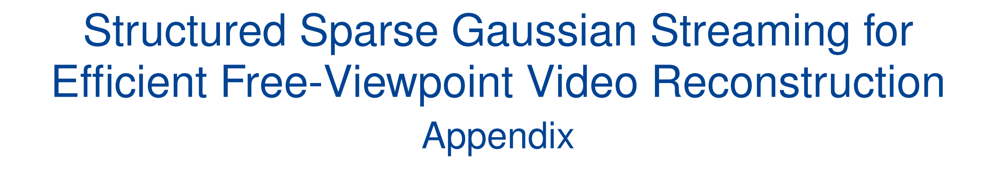

  

 

**This repository is the official appendix of "S²GS: Structured Sparse Gaussian Streaming for Efficient Free-Viewpoint Video Reconstruction".** This appendix complements the main manuscript with implementation details, ablation analyses, robustness evaluations, physical testbed evaluations, failure-case discussions, and extended comparisons. Together, the material clarifies the key design choices of S$^2$GS, evaluates its effectiveness under practical perturbations and edge-deployment cases, and provides more evidence of its capabilities and limitations.

---

## 🙏 Acknowledgements

S²GS builds upon the original [QUEEN](https://github.com/NVlabs/queen) codebase. Besides, we thank all authors from [Octree-GS](https://github.com/city-super/Octree-GS) and [3D Gaussian Splatting](https://github.com/graphdeco-inria/gaussian-splatting) for their contributions.
